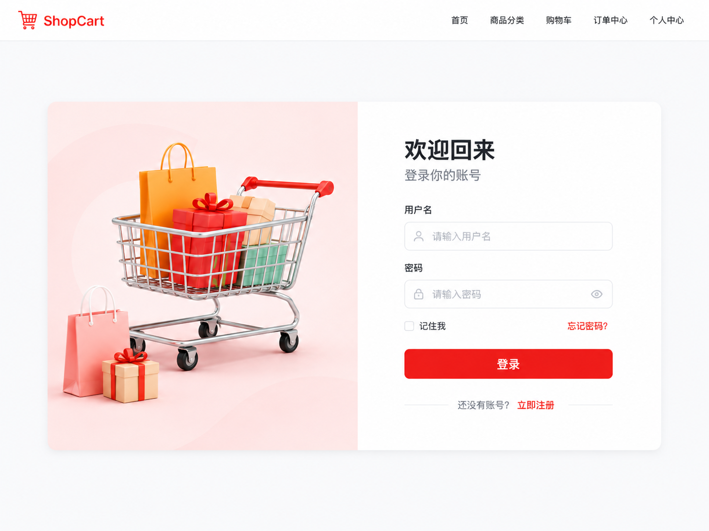
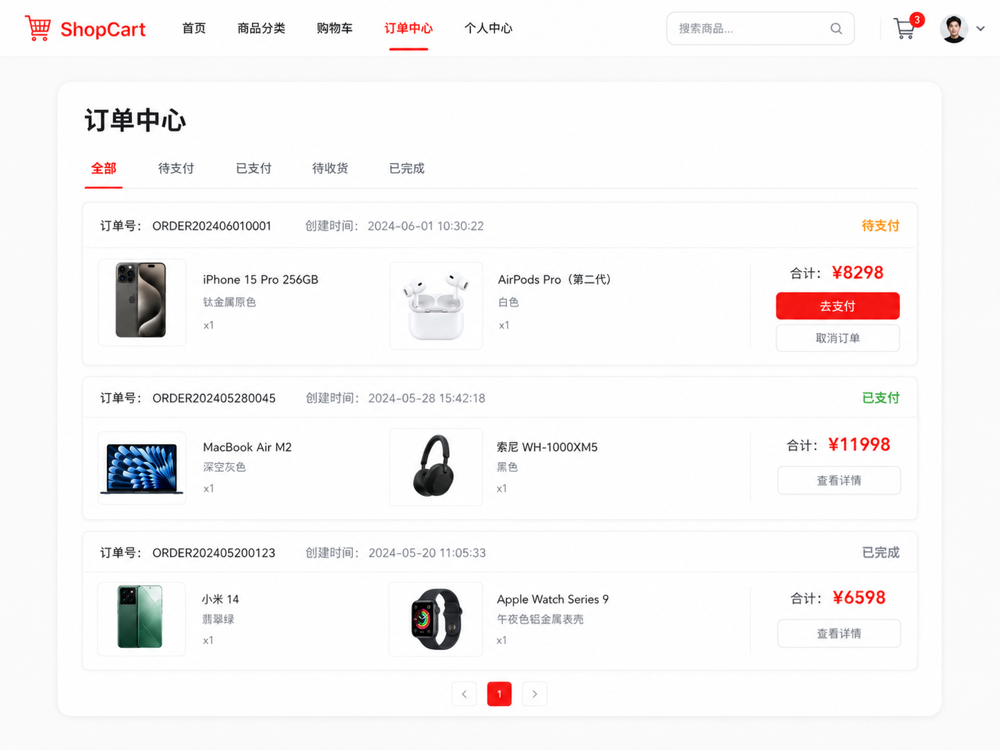
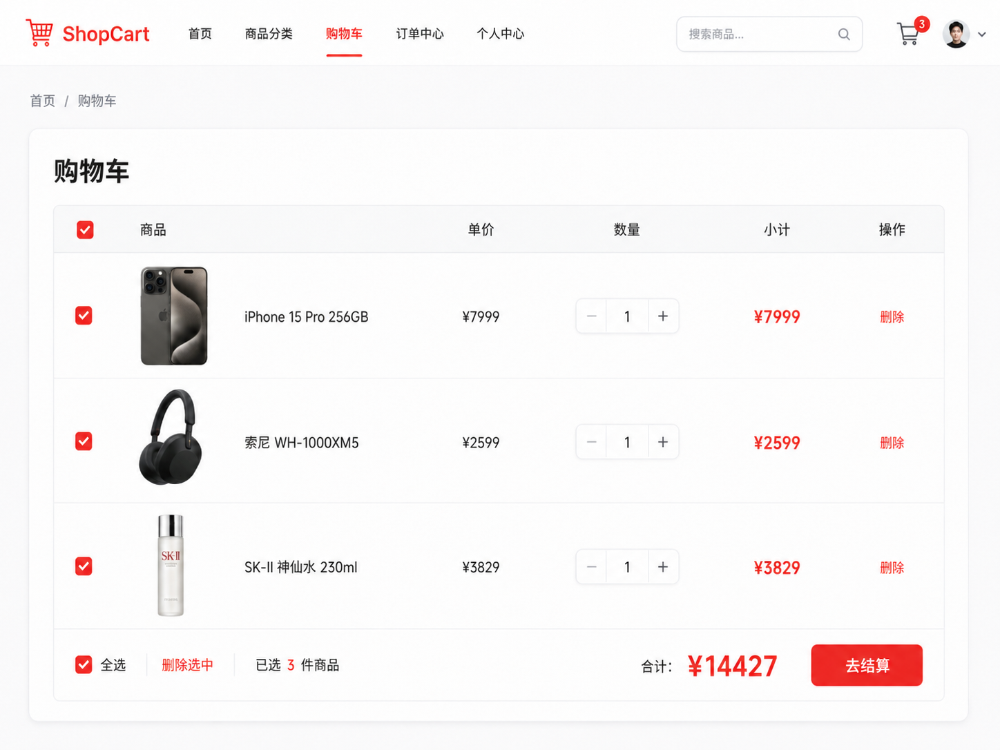
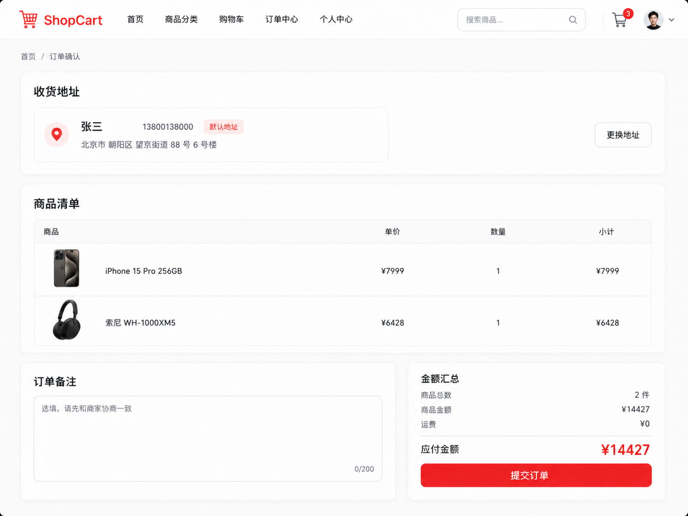
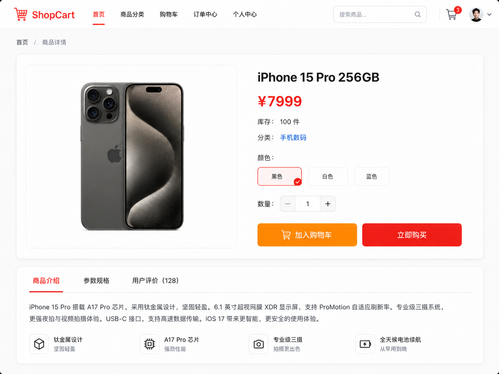

下面是优化后的**文字版本项目说明**，可以直接作为项目文档的第一版。

# 购物车实战项目：Vue3 + Go + MySQL + Docker

这是一个适合学习 Vue 框架和前后端交互的简易购物车项目。项目不追求复杂商城业务，而是重点训练：

```txt
Vue 页面开发
Vue Router 路由
Pinia 状态管理
Axios 前后端交互
Go 后端分层开发
MySQL 数据持久化
JWT 登录认证
Docker Compose 部署
```

------

# 一、项目技术栈

## 前端技术栈

```txt
Vue 3
Vite
Vue Router
Pinia
Axios
Element Plus / 原生 CSS
```

前端主要负责：

```txt
页面展示
路由跳转
登录状态保存
购物车状态管理
请求后端接口
处理 loading / error 状态
```

------

## 后端技术栈

```txt
Go
Gin
GORM
MySQL
JWT
Docker
Docker Compose
```

后端主要负责：

```txt
提供接口 API
处理登录认证
操作 MySQL 数据库
处理业务逻辑
组装 DTO 返回给前端
```

------

# 二、项目整体功能

项目包含 6 个核心模块：

```txt
1. 用户模块
2. 商品模块
3. 购物车模块
4. 订单模块
5. 地址模块
6. 登录认证模块
```

第一版不需要做得很复杂，但要保证完整闭环：

```txt
登录
浏览商品
加入购物车
修改购物车数量
提交订单
查看订单
```

------

# 三、核心页面

## 1. 登录页

路由：

```txt
/login
```

功能：

```txt
输入用户名
输入密码
点击登录
调用后端登录接口
登录成功后保存 token
登录成功后跳转商品列表页
登录失败显示错误提示
```

接口：

```txt
POST /api/login
```

请求参数：

```json
{
  "username": "admin",
  "password": "123456"
}
```

返回示例：

```json
{
  "code": 200,
  "message": "登录成功",
  "data": {
    "token": "mock-token",
    "user": {
      "id": 1,
      "username": "admin",
      "nickname": "管理员"
    }
  }
}
```

页面展示内容：

```txt
标题：欢迎回来
输入框：用户名
输入框：密码
按钮：登录
链接：还没有账号？立即注册
```

------

## 2. 商品列表页

路由：

```txt
/products
```

功能：

```txt
展示商品列表
展示商品名称、图片、价格、库存
点击商品进入详情页
点击加入购物车
支持 loading 状态
支持接口错误提示
```

接口：

```txt
GET /api/products
```

返回示例：

```json
{
  "code": 200,
  "message": "success",
  "data": [
    {
      "id": 1,
      "name": "iPhone 15 Pro 256GB",
      "price": 7999,
      "stock": 100,
      "image": "/static/iphone.png",
      "category": "手机数码"
    },
    {
      "id": 2,
      "name": "MacBook Air M2",
      "price": 8999,
      "stock": 50,
      "image": "/static/macbook.png",
      "category": "电脑办公"
    }
  ]
}
```

页面展示内容：

```txt
顶部导航：ShopCart / 首页 / 商品分类 / 购物车 / 订单中心 / 个人中心
搜索框：搜索商品
轮播或 Banner：精选好物，轻松购物
分类入口：手机数码、电脑办公、家用电器、服饰鞋包、美妆个护、食品生鲜
商品卡片：图片、名称、价格、加入购物车按钮
```

------

## 3. 商品详情页

路由：

```txt
/products/:id
```

功能：

```txt
根据商品 id 获取商品详情
展示商品图片
展示商品名称
展示价格
展示库存
选择购买数量
点击加入购物车
点击立即购买
```

接口：

```txt
GET /api/products/:id
```

返回示例：

```json
{
  "code": 200,
  "message": "success",
  "data": {
    "id": 1,
    "name": "iPhone 15 Pro 256GB",
    "price": 7999,
    "stock": 100,
    "image": "/static/iphone.png",
    "description": "A17 Pro 芯片，钛金属边框，适合日常学习、办公和娱乐使用。",
    "category": "手机数码"
  }
}
```

页面展示内容：

```txt
商品图片
商品名称
商品价格
库存数量
颜色选择
数量选择
加入购物车按钮
立即购买按钮
商品介绍
参数规格
用户评价
```

------

## 4. 购物车页

路由：

```txt
/cart
```

功能：

```txt
展示当前用户购物车商品
选择商品
全选商品
修改商品数量
删除购物车商品
计算已选商品总数量
计算已选商品总价格
点击去结算
```

接口：

```txt
GET /api/cart
POST /api/cart
PUT /api/cart/:id
DELETE /api/cart/:id
DELETE /api/cart
```

页面展示内容：

```txt
购物车标题
商品勾选框
商品图片
商品名称
商品单价
数量加减
商品小计
删除按钮
全选
已选商品数量
总价
去结算按钮
```

购物车商品示例：

```json
{
  "code": 200,
  "message": "success",
  "data": [
    {
      "id": 1,
      "productId": 1,
      "name": "iPhone 15 Pro 256GB",
      "price": 7999,
      "count": 1,
      "checked": true,
      "image": "/static/iphone.png"
    }
  ]
}
```

------

## 5. 订单确认页

路由：

```txt
/checkout
```

功能：

```txt
展示选中的购物车商品
展示订单总金额
选择收货地址
填写备注
提交订单
提交成功后清空已购买购物车商品
跳转订单成功页
```

接口：

```txt
POST /api/orders
```

请求参数：

```json
{
  "addressId": 1,
  "remark": "请尽快发货",
  "items": [
    {
      "cartId": 1,
      "productId": 1,
      "count": 1
    }
  ]
}
```

返回示例：

```json
{
  "code": 200,
  "message": "下单成功",
  "data": {
    "orderNo": "ORDER202606230001"
  }
}
```

页面展示内容：

```txt
确认订单
收货地址
商品清单
商品数量
商品总价
订单备注
提交订单按钮
```

------

## 6. 订单中心页

路由：

```txt
/orders
```

功能：

```txt
展示当前用户订单列表
查看订单状态
查看订单金额
查看订单商品
取消订单
模拟支付
```

接口：

```txt
GET /api/orders
GET /api/orders/:id
PUT /api/orders/:id/cancel
PUT /api/orders/:id/pay
```

订单状态：

```txt
待支付
已支付
已取消
已完成
```

订单列表返回示例：

```json
{
  "code": 200,
  "message": "success",
  "data": [
    {
      "id": 1,
      "orderNo": "ORDER202606230001",
      "totalAmount": 7999,
      "status": "待支付",
      "createdAt": "2026-06-23 10:30:00"
    }
  ]
}
```

------

## 7. 地址管理页

路由：

```txt
/address
```

功能：

```txt
查看收货地址列表
新增地址
编辑地址
删除地址
设置默认地址
```

接口：

```txt
GET /api/addresses
POST /api/addresses
PUT /api/addresses/:id
DELETE /api/addresses/:id
PUT /api/addresses/:id/default
```

地址数据示例：

```json
{
  "id": 1,
  "receiver": "张三",
  "phone": "13800138000",
  "province": "北京市",
  "city": "北京市",
  "district": "朝阳区",
  "detail": "望京街道 88 号",
  "isDefault": true
}
```

------

# 四、后端分层设计

后端采用简单但清晰的三层结构：

```txt
Router 层
Service 层
Model 层
```

不做过度复杂的 MVC，但要有基本分层。

------

## 1. Router 层

职责：

```txt
注册接口路由
接收 HTTP 请求
绑定请求参数
调用 service
返回 JSON
```

示例职责：

```txt
POST /api/login
GET /api/products
GET /api/products/:id
GET /api/cart
POST /api/cart
POST /api/orders
```

Router 层不直接写复杂业务逻辑，也不直接拼复杂返回结构。

------

## 2. Service 层

职责：

```txt
处理业务逻辑
调用 Model 层 CRUD
校验业务规则
封装返回 DTO
给 Router 层返回统一结构
```

比如：

```txt
登录时校验用户名密码
生成 JWT token
商品列表组装 ProductDTO
加入购物车时判断商品是否存在
加入购物车时判断库存是否足够
提交订单时计算总价
提交订单时扣减库存
提交订单后清理购物车
```

Service 层是项目的业务核心。

------

## 3. Model 层

职责：

```txt
定义数据库模型
封装 CRUD 操作
使用 GORM 操作 MySQL
```

Model 层只关心数据，不关心页面，也不关心复杂业务。

例如：

```txt
UserModel
ProductModel
CartItemModel
OrderModel
OrderItemModel
AddressModel
```

------

## 4. DTO 层

DTO 是专门返回给前端的数据结构。

为什么需要 DTO？

数据库模型可能长这样：

```go
type User struct {
    ID        uint
    Username  string
    Password  string
    CreatedAt time.Time
    UpdatedAt time.Time
}
```

但返回给前端时不能返回密码。

所以返回 DTO：

```go
type UserDTO struct {
    ID       uint   `json:"id"`
    Username string `json:"username"`
    Nickname string `json:"nickname"`
}
```

DTO 的作用：

```txt
隐藏敏感字段
整理返回格式
避免直接暴露数据库模型
让前端拿到更舒服的数据
```

------

# 五、后端目录结构

推荐目录结构：

```txt
go-cart-api
├─ cmd
│  └─ main.go
├─ config
│  └─ config.go
├─ internal
│  ├─ router
│  │  └─ router.go
│  ├─ service
│  │  ├─ user_service.go
│  │  ├─ product_service.go
│  │  ├─ cart_service.go
│  │  ├─ order_service.go
│  │  └─ address_service.go
│  ├─ model
│  │  ├─ db.go
│  │  ├─ user.go
│  │  ├─ product.go
│  │  ├─ cart.go
│  │  ├─ order.go
│  │  └─ address.go
│  ├─ dto
│  │  ├─ common.go
│  │  ├─ user_dto.go
│  │  ├─ product_dto.go
│  │  ├─ cart_dto.go
│  │  └─ order_dto.go
│  └─ middleware
│     ├─ cors.go
│     └─ auth.go
├─ Dockerfile
├─ docker-compose.yml
├─ go.mod
└─ go.sum
```

------

# 六、数据库表设计

## 1. 用户表 `users`

```txt
id
username
password
nickname
created_at
updated_at
```

说明：

```txt
username：用户名
password：密码，第一版可以明文，优化版使用 bcrypt 加密
nickname：昵称
```

------

## 2. 商品表 `products`

```txt
id
name
price
stock
image
category
description
created_at
updated_at
```

说明：

```txt
name：商品名称
price：商品价格，建议用整数分，避免小数精度问题
stock：库存
image：商品图片
category：商品分类
description：商品描述
```

------

## 3. 购物车表 `cart_items`

```txt
id
user_id
product_id
count
checked
created_at
updated_at
```

说明：

```txt
user_id：用户 id
product_id：商品 id
count：购买数量
checked：是否选中
```

------

## 4. 地址表 `addresses`

```txt
id
user_id
receiver
phone
province
city
district
detail
is_default
created_at
updated_at
```

------

## 5. 订单表 `orders`

```txt
id
user_id
order_no
total_amount
status
address_snapshot
remark
created_at
updated_at
```

说明：

```txt
order_no：订单号
total_amount：订单总金额
status：订单状态
address_snapshot：下单时的地址快照
```

------

## 6. 订单商品表 `order_items`

```txt
id
order_id
product_id
product_name
product_image
price
count
subtotal
created_at
updated_at
```

说明：

```txt
订单商品保存商品快照
即使商品后来改价，历史订单也不受影响
```

------

# 七、核心接口清单

## 用户接口

| 方法 | 地址             | 说明             | 是否登录 |
| ---- | ---------------- | ---------------- | -------- |
| POST | `/api/register`  | 注册             | 否       |
| POST | `/api/login`     | 登录             | 否       |
| GET  | `/api/user/info` | 获取当前用户信息 | 是       |

------

## 商品接口

| 方法 | 地址                | 说明     | 是否登录 |
| ---- | ------------------- | -------- | -------- |
| GET  | `/api/products`     | 商品列表 | 否       |
| GET  | `/api/products/:id` | 商品详情 | 否       |

------

## 购物车接口

| 方法   | 地址            | 说明              | 是否登录 |
| ------ | --------------- | ----------------- | -------- |
| GET    | `/api/cart`     | 获取购物车        | 是       |
| POST   | `/api/cart`     | 加入购物车        | 是       |
| PUT    | `/api/cart/:id` | 修改数量/选中状态 | 是       |
| DELETE | `/api/cart/:id` | 删除购物车商品    | 是       |
| DELETE | `/api/cart`     | 清空购物车        | 是       |

------

## 地址接口

| 方法   | 地址                         | 说明         | 是否登录 |
| ------ | ---------------------------- | ------------ | -------- |
| GET    | `/api/addresses`             | 地址列表     | 是       |
| POST   | `/api/addresses`             | 新增地址     | 是       |
| PUT    | `/api/addresses/:id`         | 修改地址     | 是       |
| DELETE | `/api/addresses/:id`         | 删除地址     | 是       |
| PUT    | `/api/addresses/:id/default` | 设置默认地址 | 是       |

------

## 订单接口

| 方法 | 地址                     | 说明     | 是否登录 |
| ---- | ------------------------ | -------- | -------- |
| POST | `/api/orders`            | 创建订单 | 是       |
| GET  | `/api/orders`            | 订单列表 | 是       |
| GET  | `/api/orders/:id`        | 订单详情 | 是       |
| PUT  | `/api/orders/:id/pay`    | 模拟支付 | 是       |
| PUT  | `/api/orders/:id/cancel` | 取消订单 | 是       |

------

# 八、统一返回格式

后端所有接口统一返回：

```json
{
  "code": 200,
  "message": "success",
  "data": {}
}
```

失败示例：

```json
{
  "code": 400,
  "message": "商品库存不足",
  "data": null
}
```

常见状态码：

```txt
200：成功
400：参数错误 / 业务错误
401：未登录 / token 无效
404：资源不存在
500：服务器错误
```

------

# 九、登录认证设计

登录成功后，后端返回 JWT token。

前端保存：

```txt
localStorage
```

后续请求通过请求头携带：

```txt
Authorization: Bearer token
```

前端 axios 请求拦截器负责自动添加 token。

后端 auth 中间件负责：

```txt
读取 Authorization
解析 JWT
校验 token 是否有效
把 user_id 写入上下文
后续 service 根据 user_id 查询数据
```

需要登录的接口：

```txt
/api/user/info
/api/cart
/api/orders
/api/addresses
```

不需要登录的接口：

```txt
/api/login
/api/register
/api/products
/api/products/:id
```

------

# 十、前端目录结构

```txt
vue-cart-web
├─ src
│  ├─ api
│  │  ├─ user.js
│  │  ├─ product.js
│  │  ├─ cart.js
│  │  ├─ order.js
│  │  └─ address.js
│  ├─ components
│  │  ├─ ProductCard.vue
│  │  ├─ CartItem.vue
│  │  └─ NavBar.vue
│  ├─ router
│  │  └─ index.js
│  ├─ stores
│  │  ├─ user.js
│  │  └─ cart.js
│  ├─ utils
│  │  └─ request.js
│  ├─ views
│  │  ├─ Login.vue
│  │  ├─ ProductList.vue
│  │  ├─ ProductDetail.vue
│  │  ├─ Cart.vue
│  │  ├─ Checkout.vue
│  │  ├─ OrderList.vue
│  │  └─ Address.vue
│  ├─ App.vue
│  └─ main.js
├─ Dockerfile
├─ nginx.conf
├─ package.json
└─ vite.config.js
```

------

# 十一、前端核心状态设计

## user store

```txt
token
userInfo
isLogin
login()
logout()
fetchUserInfo()
```

用途：

```txt
保存登录状态
保存用户信息
控制页面权限
退出登录清理 token
```

------

## cart store

```txt
cartList
selectedList
totalCount
totalPrice
fetchCart()
addToCart()
updateCartItem()
removeCartItem()
clearCart()
```

用途：

```txt
保存购物车列表
计算选中商品数量
计算选中商品价格
同步后端购物车接口
```

------

# 十二、Docker 部署设计

使用 Docker Compose 启动三个服务：

```txt
frontend：Vue 打包后的 Nginx 服务
backend：Go API 服务
mysql：MySQL 数据库
```

------

## docker-compose 服务

```txt
services:
  mysql:
    image: mysql:8.0
    ports:
      - "3306:3306"

  backend:
    build: ./go-cart-api
    ports:
      - "8080:8080"
    depends_on:
      - mysql

  frontend:
    build: ./vue-cart-web
    ports:
      - "5173:80"
    depends_on:
      - backend
```

启动命令：

```bash
docker-compose up -d
```

访问地址：

```txt
前端：http://localhost:5173
后端：http://localhost:8080
MySQL：localhost:3306
```

------

# 十三、项目运行流程

完整业务流程：

```txt
1. 用户打开前端页面
2. 进入登录页
3. 输入账号密码
4. 前端调用 POST /api/login
5. 后端校验用户，生成 JWT
6. 前端保存 token
7. 用户进入商品列表页
8. 前端调用 GET /api/products
9. 用户点击加入购物车
10. 前端调用 POST /api/cart
11. 用户进入购物车页
12. 前端调用 GET /api/cart
13. 用户修改数量或勾选商品
14. 前端调用 PUT /api/cart/:id
15. 用户点击去结算
16. 用户选择地址
17. 前端调用 POST /api/orders
18. 后端生成订单、订单商品、扣库存、清理购物车
19. 前端跳转订单成功页
20. 用户查看订单中心
```

------

# 十四、学习顺序建议

建议按这个顺序开发：

```txt
1. 搭建 Go + Gin 项目
2. 连接 MySQL
3. 定义 User / Product / Cart / Order 模型
4. 写商品列表接口
5. Vue 商品列表页请求接口
6. 封装 axios request.js
7. 写登录接口
8. Vue 登录页 + Pinia user store
9. JWT 中间件
10. 写购物车接口
11. Vue 购物车页 + Pinia cart store
12. 写地址接口
13. 写订单接口
14. Vue 订单确认页
15. Dockerfile
16. docker-compose.yml
```

------

# 十五、项目复杂度控制

第一版不要做这些：

```txt
真实支付
后台管理系统
复杂权限系统
商品 SKU
优惠券
秒杀
库存并发锁
消息队列
Redis 缓存
微服务
```

第一版只做：

```txt
登录
商品
购物车
地址
订单
Docker 部署
```

这样难度刚好，能把 Vue 和 Go 后端的核心流程吃透。

------

# 十六、最终项目效果

最终你会得到一个完整的小型商城购物车项目：

```txt
用户可以登录
可以浏览商品
可以查看商品详情
可以加入购物车
可以修改购物车数量
可以选择收货地址
可以提交订单
可以查看订单列表
数据存储在 MySQL 中
前后端都可以通过 Docker Compose 启动
```

 
 
 
 
 
